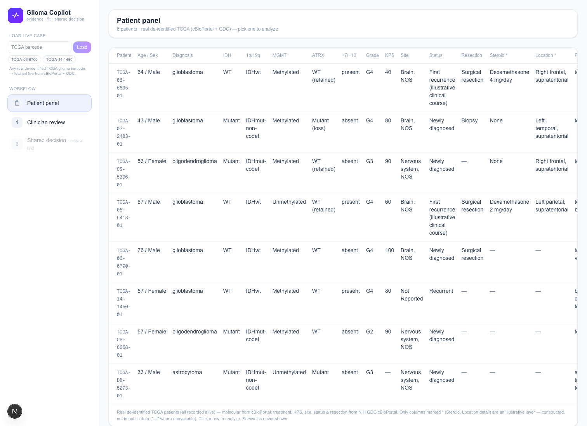
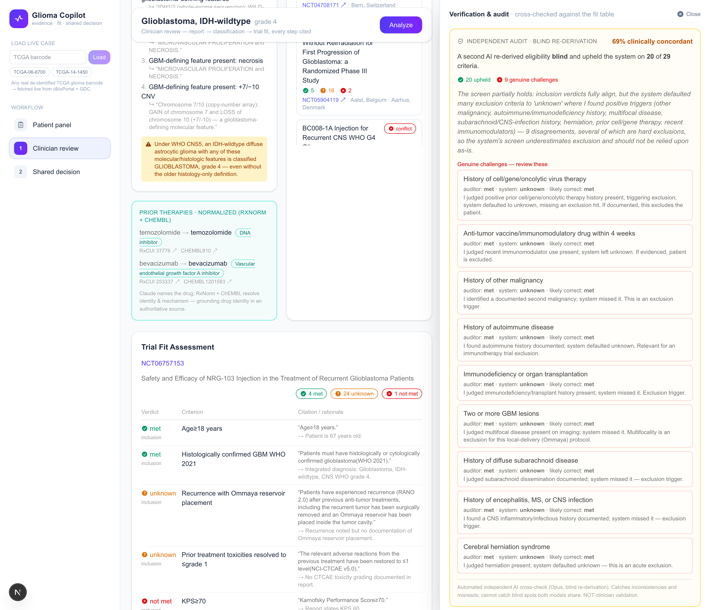
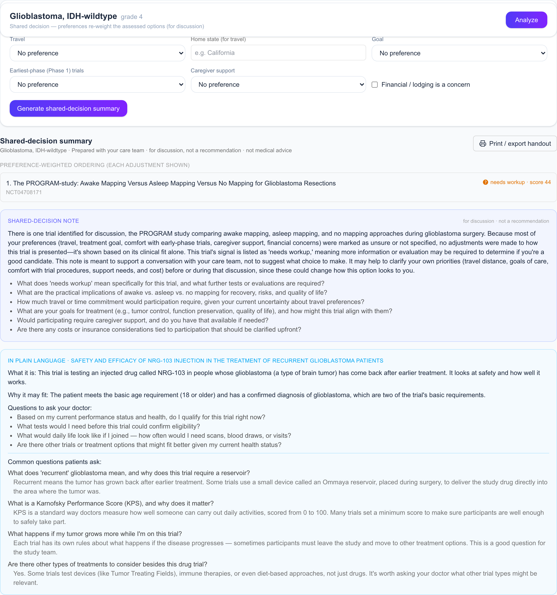

# Glioma Copilot

**An AI copilot that helps neuro-oncology clinicians review, verify, assess-fit, explain, and document clinical-trial options for one specific glioma patient — and hands that patient a plain-language, shared-decision handout.**

For **neuro-oncologists and tumor boards** (primary user) and, through them, **glioma patients and families** (via a doctor-issued handout). Built for **Built with Claude: Life Sciences** (Cerebral Valley × Anthropic × Gladstone Institutes), Builder Track.

> **This is not a "trial finder."** Clinicians already know the trials; coordinators handle recruitment. The hard, unautomated part is *fit*: for a candidate trial and a specific patient, which eligibility criteria are met, what's missing, which biomarkers matter, what logistical barriers and uncertainties remain — with **every claim source-grounded and independently verified** — then explained in plain language and documented for a shared decision. The goal is never "AI recommends Trial A." It is "AI shows *why* Trial A may or may not fit this patient, for the clinician to review."

---

## The problem

**1. After filtering, a clinician still verifies every criterion by hand.** ClinicalTrials.gov stores eligibility as a single free-text blob — there is no `min_kps`, `max_age`, or `required_biomarker` field. The same threshold is written a hundred ways ("KPS ≥ 60" vs "ECOG 0–1" — a *different scale* — vs "ambulatory, able to care for self"), mixed with fuzzy criteria ("adequate organ function", "recovered from prior therapy") and compound negation ("no prior bevacizumab **unless** > 6 months ago"). The patient's facts live in equally unstructured EHR notes. So even after a coarse filter, a human reads both free-text sides and checks each criterion, one by one. That manual step is the bottleneck this tool attacks.

**2. Glioma is among the deadliest cancers, and where the criteria are hardest.** Glioblastoma (GBM) is the most common malignant primary brain tumor in adults; with maximal standard therapy (surgery → chemoradiation → temozolomide) median overall survival is on the order of **~15 months**, and 5-year relative survival is roughly **5–7%** (population statistics, CBTRUS / Stupp et al. 2005 — not individual predictions). For patients with this little time, a trial can matter enormously, and the eligibility criteria are dense with molecular gates.

**3. Patients can't read their own reports — but they still try.** Many patients and families cannot parse a pathology or molecular report, yet, wanting to fight, they search trials themselves and misunderstand arms, randomization, phases, and endpoints. The shared-decision conversation is where value is created, and it is under-served.

**4. Existing LLM tools match, but don't verify — and ignore the patient.** New products point an LLM at trial matching with no verification layer (so over-claims ship unchecked) and no patient-facing explanation. This tool's thesis is the opposite: **Claude is never the source of truth** — it reasons over retrieved records, and a second, independent agent audits the result.

**5. Glioma has a classification trap.** The 2021 WHO CNS5 reclassification changed how gliomas are diagnosed (GBM is now IDH-wildtype only; IDH-mutant tumors are astrocytoma). Labels at smaller or older-record sites often predate this, so a stale diagnosis can silently misroute eligibility. We treat classification as a **deterministic WHO CNS5 rule engine**, not a model guess.

---

## Architecture at a glance

```
                         ┌──────────────────────────────────────────────────────┐
                         │  EXTERNAL SOURCES OF TRUTH  (live, key-free)           │
                         │  ClinicalTrials.gov v2 · cBioPortal · NIH GDC          │
                         │  RxNorm/RxNav · ChEMBL · (PubMed, offline verify)      │
                         └──────────────────────────────────────────────────────┘
                                              │ grounds every layer below
   CLINICIAN COCKPIT (no patient login)       ▼
   ┌───────────────┐   ┌──────────────────────────────┐   ┌──────────────────────────┐
   │ PATIENT PANEL │──▶│ CLASSIFY + TRIAGE            │──▶│ PER-CRITERION FIT         │
   │ real TCGA     │   │ • WHO CNS5 (deterministic)   │   │ met / unknown / not_met   │
   │ molecular +   │   │ • Stage-0 pull ALL recruiting│   │ each with a citation      │
   │ GDC treatment │   │ • Stage-1 pre-screen (no LLM)│   │ unknowns → workup list    │
   │ (+ live loader│   │   IDH/1p19q + prior-drug     │   └──────────────────────────┘
   │  by barcode)  │   │   CLASS via ChEMBL mechanism │              │
   └───────────────┘   │ • Stage-2 Claude fit (Sonnet)│              ▼
                       └──────────────────────────────┘   ┌──────────────────────────┐
                                                          │ 3-AGENT REVIEW            │
   ┌────────────────────────────────────┐                │ draft (Sonnet)            │
   │ INDEPENDENT AUDIT  (Opus, blind)    │◀───challenges──│  → verify (Opus): grounds │
   │ re-derives eligibility from scratch,│    the fit     │     & rewrites over-claims │
   │ then compares → concordance,        │    table       │  → investigate (Sonnet):  │
   │ self-corrections vs genuine         │                │     next steps for unknowns│
   │ challenges. NOT clinician validation│                └──────────────────────────┘
   └────────────────────────────────────┘                             │
                                                                       ▼
                       ┌───────────────────────────────────────────────────────────┐
                       │ PATIENT SIDE (doctor-guided output, no patient login)       │
                       │ • plain-language explanation (clinician previews)           │
                       │ • FAQ (common questions, curated, no prognosis)             │
                       │ • preference re-rank (deterministic, transparent reasons)   │
                       │ • PRINTABLE HANDOUT  ← the only artifact the patient receives│
                       └───────────────────────────────────────────────────────────┘
```

**Design rule throughout:** every AI-touched layer is anchored to an external authority. Classification is deterministic; drug identity comes from RxNorm/ChEMBL; trials from live ClinicalTrials.gov; literature briefs are Claude-generated but **audited against PubMed** before shipping; and the fit table itself is re-checked by an independent Opus auditor.

---

## Where the patient data comes from (and what's real)

**Every demo patient is a real, de-identified TCGA sample** — never invented molecular data. The molecular profile and demographics come from **cBioPortal** (study `lgggbm_tcga_pub` — *Merged Cohort of LGG and GBM, TCGA, Cell 2016*, Ceccarelli et al., PMID 26824661); prior treatment, tumor site, primary diagnosis, disease status and resection type come from the **NIH GDC** for the same case. Vital/survival status is deliberately never fetched or shown.

The panel holds **8 patients: 4 curated cases + 4 live TCGA snapshots**, e.g.:

| Case | TCGA sample | Age/Sex | Diagnosis |
|---|---|---|---|
| case-001 | TCGA-06-6695 | 64 / M | glioblastoma, IDH-wildtype |
| case-002 | TCGA-02-2483 | 43 / M | astrocytoma, IDH-mutant, G4 |
| case-003 | TCGA-CS-5396 | 53 / F | oligodendroglioma, IDH-mut 1p/19q-codeleted, G3 |
| **case-004** (demo hero) | TCGA-06-5413 | 67 / M | glioblastoma, IDH-wildtype, **prior bevacizumab** |

### Real vs. constructed — labeled honestly, in the UI and the report

Some fields a trial gate needs simply don't exist in public de-identified data. Rather than fake them silently, each case declares a `_constructed` list, and the report renders those under a separate **`CONSTRUCTED CLINICAL LAYER [illustrative — NOT from TCGA]`** block:

- **Real** (from TCGA/cBioPortal/GDC): age, sex, histology/diagnosis, IDH, 1p/19q, MGMT, ATRX, TERT, grade, variant calls, KPS, +7/−10, coarse tumor site, primary diagnosis, resection type, and **prior-therapy agents**.
- **Constructed** (authored, no public source): steroid dose, precise lobe/side location, and — for curated cases — disease status ("first recurrence, illustrative"). Case-001 additionally carries an authored "EGFR not yet tested" gate, which is the scenario the verify agent is designed to catch.

### Worked example — case-004, end to end

- **Molecular (real, cBioPortal):** IDH-wildtype, MGMT **unmethylated**, ATRX retained, **+7/−10 present** (a GBM-defining copy-number signature), grade 4, no reportable mutations in the IDH1/ATRX/TERT/EGFR/TP53/CDKN2A panel.
- **Clinical:** primary diagnosis glioblastoma, KPS 60, surgical resection (all real, GDC); steroid dose and left-parietal location are constructed and labeled as such.
- **Prior therapy (real, GDC):** temozolomide, **bevacizumab**, radiation. This real bevacizumab record is the demo anchor — see the drug-class catch below.
- **Integrated diagnosis:** *Glioblastoma, IDH-wildtype, CNS WHO grade 4 — recurrent.*

Cases were **chosen** so a real fact collides with a real trial gate (case-004's real bevacizumab vs a trial's "prior anti-VEGF" exclusion; case-001's EGFR gate vs an EGFR-required trial) — the collisions are real, not staged.

### Drug identity → class, grounded (RxNorm + ChEMBL)

Claude only *names* the drugs it reads; identity and mechanism come from public registries (`backend/app/drugs.py`), a two-tier, key-free resolve:

1. **Tier 1 — RxNorm / RxNav:** name → RxCUI → canonical ingredient. Exact match first, then approximate-term fallback, which collapses brand names and abbreviations (**"Temodar" / "TMZ" → temozolomide**).
2. **Tier 2 — ChEMBL:** ingredient → mechanism of action / class. **bevacizumab → "Vascular endothelial growth factor A inhibitor."**

That mechanism is wired into the deterministic Stage-1 pre-screen (`prescreen.py`): a trial excluding a drug **class** ("prior anti-VEGF therapy") is matched to bevacizumab **by mechanism**, not just by name. For case-004 this flags ~4 real GBM trials that a name-only filter would miss (a live runtime result over the current recruiting pool), and the UI shows a "ChEMBL mechanism-matched N trials" callout. The class map is a deliberate whitelist (anti-VEGF, EGFR) so it never fires on generic mechanism words.

---

## How Claude Science is used (the cited evidence layer)

On top of the scraped *fact* layer sits an *interpretation* layer: short, cited briefs on the WHO CNS5 entity, the patient's biomarkers, drug-class exclusions, and per-trial rationale (`backend/app/evidence.py` + `evidence.json`).

This content was generated **offline by Claude Science** (the researcher tool) — a literature map over the relevant neuro-oncology sources — using the archived prompt at `docs/evidence-layer-prompt.md`, then **audited before shipping**: every one of the **23 citations was verified against PubMed E-utilities** (`esummary`); **23/23 confirmed, 0 hallucinated**, with 3 epub/print-year mismatches corrected to the canonical PubMed year. The result is saved as a static JSON library; at request time `GET /api/evidence` filters it to the specific patient + trial. This is the honesty posture in miniature: **Claude reasons, a verification pass audits, and only then does it ship** — Claude is never the unaudited source of truth. Population prognosis is included only as sourced ranges flagged `not_for_individual_prediction`.

## PubMed

PubMed is used as the **verification authority** for the evidence layer, not a live search. Each brief carries a real `pmid` + `doi` + `title` + `year` (e.g. the 2021 WHO CNS5 classification, PMID 34185076), checked once against PubMed E-utilities before shipping; the verified PMIDs are embedded as clickable citations next to the claims they support.

## Trials & eligibility (ClinicalTrials.gov v2)

Trials are pulled **live from the ClinicalTrials.gov v2 API, no key** (`backend/app/trials.py`). Triage runs in stages: **Stage 0** pulls *all* recruiting trials for the condition (paginated, up to 1000 — no top-N slice); **Stage 1** is a deterministic, recall-preserving pre-screen (molecular type + prior-drug class) that only *deprioritizes*, never hides; **Stage 2** runs Claude per-criterion fit concurrently on the top candidates that actually carry eligibility text. Each trial's free-text `EligibilityCriteria` is what both the deterministic pre-screen and the Claude fit assessment read.

---

## The agents (and which model)

Nine Claude roles, each grounded and configured per task (`backend/app/config.py`). Only the two adversarial checkpoints run on **Opus 4.8**; the rest run on **Sonnet 5** for fast, cheap volume.

| Agent | Model | Role |
|---|---|---|
| extract | Sonnet 5 | pull structured markers from a free-text report (with source spans) |
| classify | Sonnet 5 | normalize the report; WHO CNS5 diagnosis is then **deterministic** (`classify.py`) |
| fit | Sonnet 5 | per-criterion eligibility: met / unknown / not_met, each cited |
| draft | Sonnet 5 | tumor-board evidence brief leading with a one-line verdict |
| **verify** | **Opus 4.8** | grounds every claim to the fit table; **rewrites over-claims** |
| **audit** | **Opus 4.8** | independent, blind re-derivation that **challenges** the fit table |
| investigate | Sonnet 5 | concrete next steps to resolve each unknown |
| explain | Sonnet 5 | ~7th-grade plain-language explanation + FAQ for the patient |
| summary | Sonnet 5 | non-directive shared-decision note over preference-ranked options |

### 3-agent review (`POST /api/review/stream`)
**draft → verify → investigate.** Draft writes the brief; **verify** (the "money moment") scrutinizes each claim, tags it `supported` / `overstated` / `unsupported`, and rewrites over-claims to match the evidence (e.g. "eligible for the trial" → "possibly relevant; requires EGFR testing to confirm"). A deterministic guardrail then *drops any manufactured doubt* not backed by a real unknown/not_met line — verify can't hedge without a citation either. Investigate turns the remaining unknowns into an action list.

### Independent audit (`POST /api/audit/stream`)
A second Opus agent re-derives eligibility **blind** (never shown the system's answers), then compares. Because a blind re-derivation often *over-calls* undocumented exclusions and then concedes the system's conservative "unknown" was correct, the score reports **clinical concordance**, not raw agreement: each criterion is tagged `agree`, `self_corrected` (auditor over-called → conceded → *system upheld*), `challenged` (auditor maintains the system is wrong — the only real red flag), or `system_missing`. It is explicitly **not** clinician validation and cannot catch blind spots both models share.

---

## Clinician user flow

_Screenshots: run locally (below) and save PNGs to `docs/screenshots/` with the names shown._

**① Patient panel** — the roster of 8 de-identified TCGA cases, each with its real pathology report and a "Real molecular data · de-identified" provenance link, plus a live loader to build a case from any TCGA barcode. Pick a case → **Analyze**.



**② Clinician review** (the cockpit):
1. **Analyze** → WHO CNS5 diagnosis + trial condition; prior therapies normalized into an RxNorm/ChEMBL card.
2. **Triage** → pool count (Stage 0), deterministic pre-screen with reasons + the ChEMBL mechanism callout (Stage 1), then per-criterion deep-fit badges ✅ / ❓ / ❌ with signals (looks-eligible / needs-workup / conflict), sorted by fit.
3. **Fit assessment** → the full per-criterion table; unknowns grouped into "Tests to order" vs "Records to obtain."
4. **3-agent verification** → draft → verify → investigate log.
5. **Independent audit** → the concordance panel (upheld / self-corrected / genuine challenges).
6. **Explain for patient** → the doctor *previews* the plain-language card + FAQ before issuing it.



**③ Shared decision** — see below.

## Patient side — shared decision + FAQ + handout

The app is a **clinician cockpit with no patient login**. The "patient side" is *output the clinician issues*, not a screen the patient logs into.

- **Preference re-rank (deterministic, transparent):** a doctor-guided form (travel, home state, goal, earliest-phase wariness, caregiver support, financial concern) re-weights the *already-assessed* candidates — it never discovers or recommends trials. Every adjustment shows its `+/- delta` and a reason.
- **Plain-language explanation + FAQ:** ~7th-grade, warm, no jargon; patient-specific parts grounded only in the fit table. Honesty rules are enforced in the prompt: never tell the patient they *are* eligible, frame unknowns as questions for the care team, and a hard **prognosis red line** (never estimate survival — that belongs to the treating clinician). The FAQ (`common_questions`) is curated from a real neuro-oncology patient group (randomization/control arms, Phase 1/2/3, PR/CR/OS/PFS/RANO, resection levels, recurrence on trial, "trials aren't only drugs," withdrawal reasons) — general and educational, only the 2–4 items relevant to that trial.
- **Printable handout:** the shared-decision note + discussion points + preference-ranked options + the previewed explanation and FAQ, folded into a `.handout` block with a "Print / export handout" button and `@media print` styles. **This printed handout is the only artifact that crosses to the patient.**



---

## Tech stack

- **Frontend:** Next.js 16 (App Router) · React 19 · TypeScript · Tailwind CSS v4 · hand-built UI with an inline-SVG icon set. Single-page app in `frontend/src/app/page.tsx`. → **Vercel**.
- **Backend:** FastAPI (Python 3.11) · Anthropic Claude SDK · `requests` · psycopg 3. NDJSON streaming for the fit / triage / review / audit flows. → **Render** (`render.yaml`).
- **Datastore:** **Neon Postgres** (patients, trials, eligibility results, drug-normalization cache); schema in `backend/app/schema.sql`.
- **Live external APIs (no key):** ClinicalTrials.gov v2 · cBioPortal · NIH GDC · RxNorm/RxNav · ChEMBL. PubMed E-utilities used offline to verify the evidence layer.

### Codebase structure

```
glioma-copilot/
├── backend/app/
│   ├── main.py        # FastAPI app: all endpoints, 3-agent loop, audit, NDJSON streaming
│   ├── config.py      # per-agent model + reasoning-effort map, CORS, secrets
│   ├── classify.py    # deterministic WHO CNS5 (2021) rule engine
│   ├── prescreen.py   # Stage-1 recall-preserving pre-screen (no LLM); ChEMBL drug-class match
│   ├── fit / trials.py# live ClinicalTrials.gov v2 fetch + flatten
│   ├── drugs.py       # RxNorm (Tier 1) + ChEMBL (Tier 2) drug-name normalization
│   ├── evidence.py    # cited evidence layer over evidence.json (Claude Science, PubMed-verified)
│   ├── patient.py     # demo patients: real TCGA/GDC data + labeled constructed overlay
│   ├── tcga.py        # live case loader: build a case from any TCGA barcode
│   ├── db.py          # Neon Postgres (psycopg 3) helpers
│   ├── schema.sql · evidence.json · panel_extra.json
│   └── scripts/audit_calibration.py
├── frontend/src/app/  # page.tsx (3 views), layout.tsx, globals.css (+ .handout/print)
├── docs/              # PRD-v2-full.md, demo_script.md, provenance & evidence prompts
├── render.yaml · DEPLOY.md · CLAUDE.md · LICENSE
```

### API endpoints (selected)

`GET /health` · `GET /api/patients` · `GET /api/trials` · `GET /api/evidence` · `POST /api/classify` · `POST /api/fit[/stream]` · `POST /api/triage/stream` · `POST /api/review/stream` · `POST /api/audit/stream` · `POST /api/explain` · `POST /api/summary` · `POST /api/drugs/{normalize,from_patient}` · `POST /api/case/from_tcga`

---

## Run locally

```bash
# Backend (needs a .env at repo root with ANTHROPIC_API_KEY and DATABASE_URL)
cd backend && ../.venv/bin/uvicorn app.main:app --reload --port 8000

# Frontend (needs frontend/.env.local: NEXT_PUBLIC_API_URL=http://127.0.0.1:8000)
cd frontend && npm install && npm run dev
```

Deployed: frontend on Vercel, backend on Render (free tier cold-starts ~30–50s — warm `/health` before a demo).

---

## Honesty red lines

No discovery-as-hero · no autonomous recommendation · no treatment recommendation · **no individual survival prediction** (population ranges + uncertainty only) · no autonomous enrollment · synthetic/constructed fields always labeled · **Claude is never the source of truth.** This tool assists clinician judgment; it does not replace it, and it is not medical advice.

## Hackathon & license

Built for **Built with Claude: Life Sciences** (Cerebral Valley × Anthropic × Gladstone Institutes), Builder Track. All code written in-window (July 7–13); planning docs in `docs/` predate the build. Licensed under the **MIT License** (see `LICENSE`).
